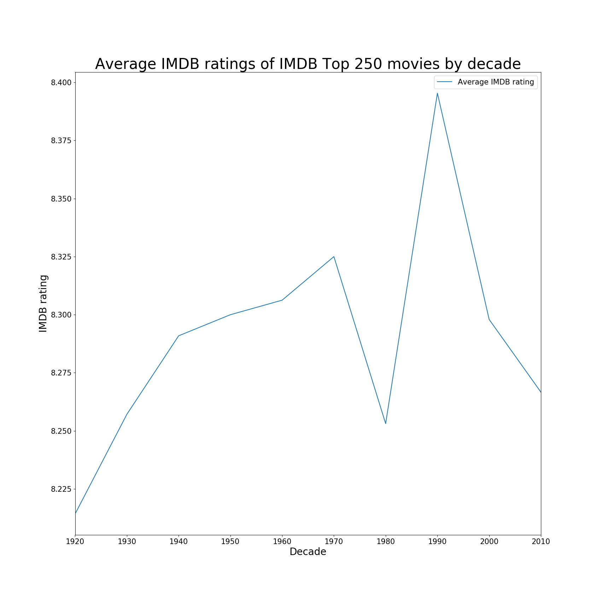
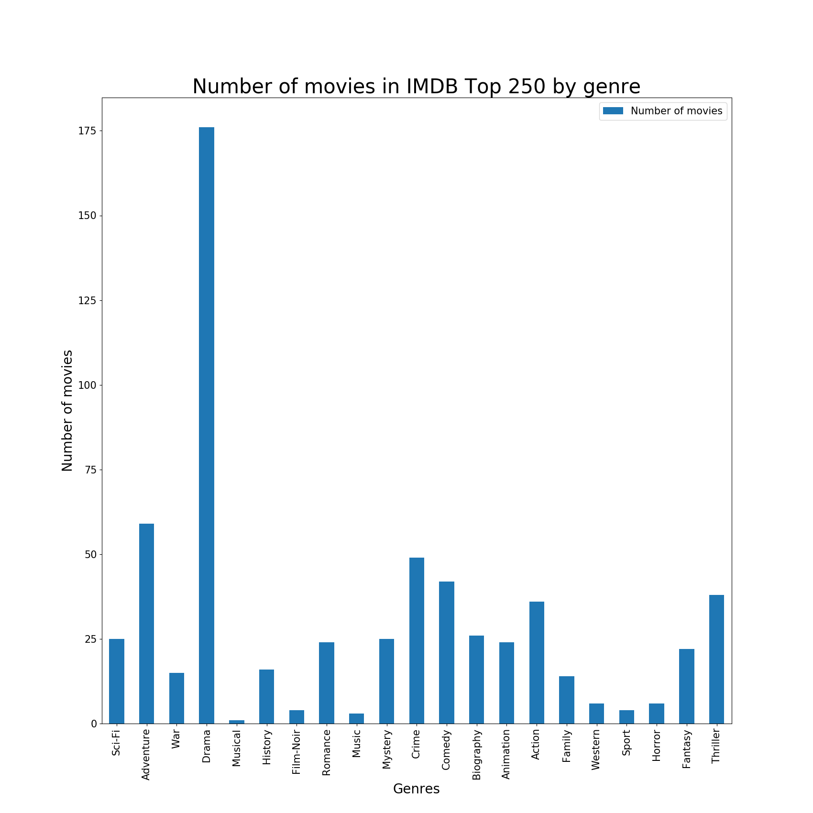

<h1 align = 'center'>Analyze-IMDB-Top-250</h1>

<h3 align = 'center'>Analysis of the IMDB Top 250 list to explore Web Scraping, DataFrames of pandas, and matplotlib, in Python</h3>

This repository analyses the [IMDB Top 250](https://www.imdb.com/search/title/?groups=top_250&sort=user_rating,desc) list, scrapes the data from it and plots the graph of:
1. The average IMDB ratings of movies in each decade
2. The number of movies in the list form each decade
3. The number of movies in the list from each genre

## How does it work? 🤔

- [```analyze.py```](analyze.py) scrapes the data form the websites and saves them as [```movieRatings.csv```](movieRatings.csv) using DataFrames from pandas.

- Then, [```plot.py```](plot.py) reads the csv file, makes some calculations for the plots, plots the data as graphs and saves them to the ```plots``` folder.

## Plots 📈



We can see that of the movies in IMDB Top 250, those released during the 1990s have the highest average IMDB ratings.


More movies released in the 2000s are in the list than any other decade.



Drama is - by far - the genre to which most of the movies in the list belong to.

## License

[MIT License](LICENSE)

---

<p align="center"> Made with ❤ by <a href="https://github.com/thepushkarp">Pushkar Patel</a></p>
